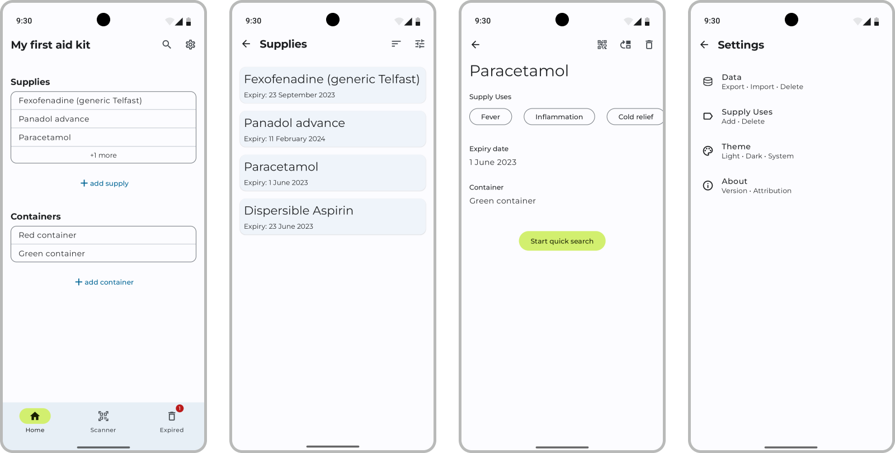

# Aidventory App
The Aidventory App is a mobile application designed to help users keep track of items in their first aid kits. 
This app provides an easy and convenient way to manage and update the inventory of first aid items, ensuring that you are prepared for any emergency situation.
#### Built with:
Jetpack Libraries, JetpackCompose, Room, CameraX, DataStore Preferences, Moshi, Hilt, 
[Accomponist](https://google.github.io/accompanist/), 
[MLKit Barcode Scanning](https://developers.google.com/ml-kit/vision/barcode-scanning/android), 
[Lottie-Compose](https://github.com/airbnb/lottie/blob/master/android-compose.md),
[Google Zxing](https://github.com/zxing/zxing).

## Installation
1. Clone the repository: `git clone https://github.com/yuriikonovalov/aidventory.git`
2. Open the project in Android Studio.
3. Connect your Android device to your computer or set up an emulator.
4. Build and run the app on your device/emulator.

## Features
#### Supply Management
Easily add, remove, and update supplies in your first aid kit inventory.
#### Container Management
Create and manage containers to organize your supplies within the first aid kit.
#### QR/Barcode Scanning
Quickly add and search for supplies by scanning the QR code or barcode on the supply.
#### Expired Supplies List
Access a dedicated list of expired supplies for quick identification and replacement.
#### Expiration Notifications
Receive timely notifications when supplies are about to expire, ensuring that you are aware of items that need to be replaced.
#### PDF QR Code Sharing
Share the QR codes of supplies and containers as PDF files, making it easy to distribute and access the inventory information.
#### Data Import and Export
Export and import inventory data from and into a JSON file, allowing for easy backup and migration between devices.

## License
This project is licensed under the [MIT](https://github.com/yuriikonovalov/aidventory/blob/main/License) License. Feel free to modify and distribute this application as per the license terms.
